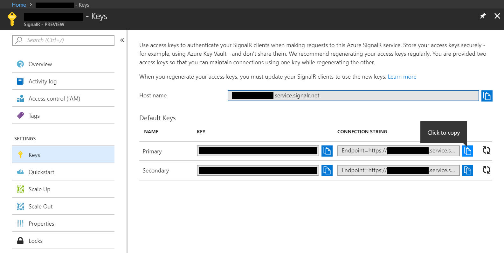

# Serverless real-time messaging demo

## Intro

This demo shows how to implement serverless real-time messaging using Azure Functions V2 with C# and Azure SignalR Service without requiring an ASP.NET Core backend.

Based on the bindings provided by Anthony Chu: [https://github.com/anthonychu/AzureAdvocates.WebJobs.Extensions.SignalRService]([https://github.com/anthonychu/AzureAdvocates.WebJobs.Extensions.SignalRService])

## Prerequisites

- [Azure Function Core Tools](https://github.com/Azure/azure-functions-core-tools) (V2)

## Usage

### Create Azure SignalR Service instance

1. Create an Azure SignalR Service instance in the Azure Portal. Go to Keys and note the connection string, you'll need this later.



### Run Function App

1. Clone repository
2. Add local.settings.json to the project and provide these values:

```json
{
  "IsEncrypted": false,
  "Values": {
    "AzureWebJobsStorage": "UseDevelopmentStorage=true",
    "AzureWebJobsDashboard": "UseDevelopmentStorage=true",
    "AzureSignalRConnectionString": "Endpoint=INSERT_YOUR_SIGNALRSERVICE_ENDPOINT_HERE;"
  },
  "Host": {
    "LocalHttpPort": 7071,
    "CORS": "*"
  }
}
```

3. Start Debugging

### Run Angular Client App

1. Clone repository
2. Run npm install to install required dependencies
3. Run ng serve to start local test server
4. Open http://localhost:4200 in (multiple) browser windows
5. type message and send

### Run UWP Client App

Please note that at least the Windows Fall Creators Update is required for this client as the Microsoft.AspNetCore.SignalR library requires .NETStandard 2.0 which was introduced to UWP with the Fall Creators Update.